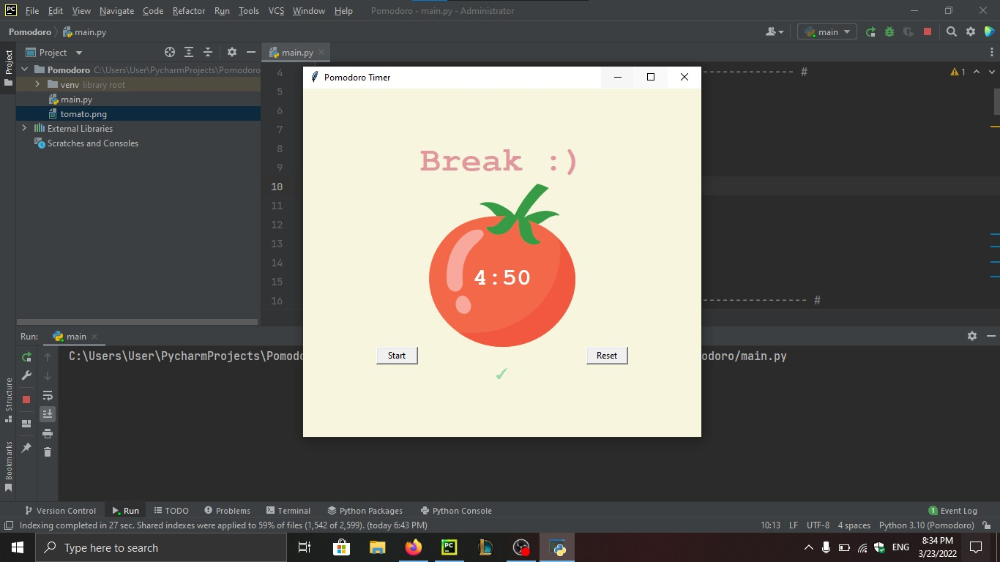

# Pomodoro Timer
A simple Python application that implements a Pomodoro Timer using the Tkinter library.

## Features
- Start the timer to work for a specified duration.
- Take short breaks after each work session.
- Take a long break after completing a certain number of work sessions.
- Reset the timer to its initial state.

## Requirements
- Python 3.x
- `Tkinter` library

## Usage
1. Run the Python script.
2. Click the "Start" button to start the timer.
3. The timer will show the time remaining for the current session.
4. After each work session, the timer will automatically switch to a break session.
5. After completing a certain number of work sessions, the timer will switch to a long break session.
6. To reset the timer, click the "Reset" button.

## Screenshots

## Acknowledgments
The project is inspired by the Pomodoro Technique developed by Francesco Cirillo.
